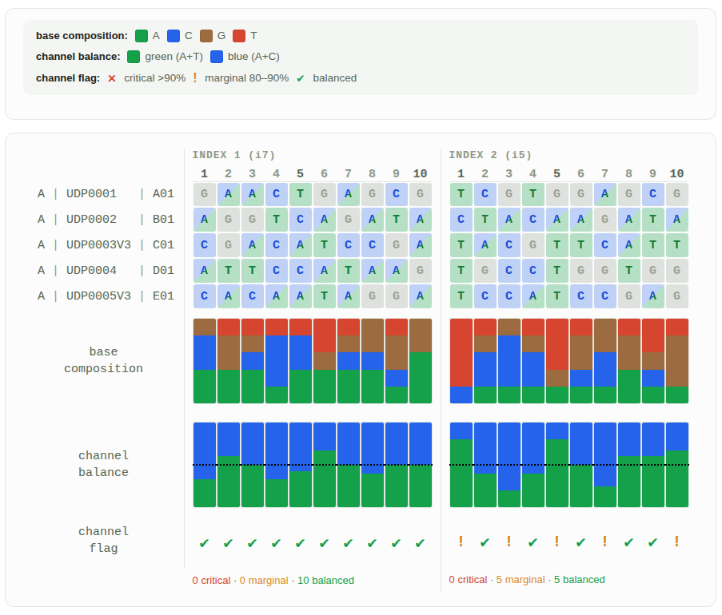

Quick way to check color balance of an Illumina index pool for two-channel chemistry aboard Miseq/NextSeq. 

[Open Tool](https://lmolokin.github.io/illumina_index_color_balancing/two_channel_chemistry.html)

Example showing a 5-plex pool:

